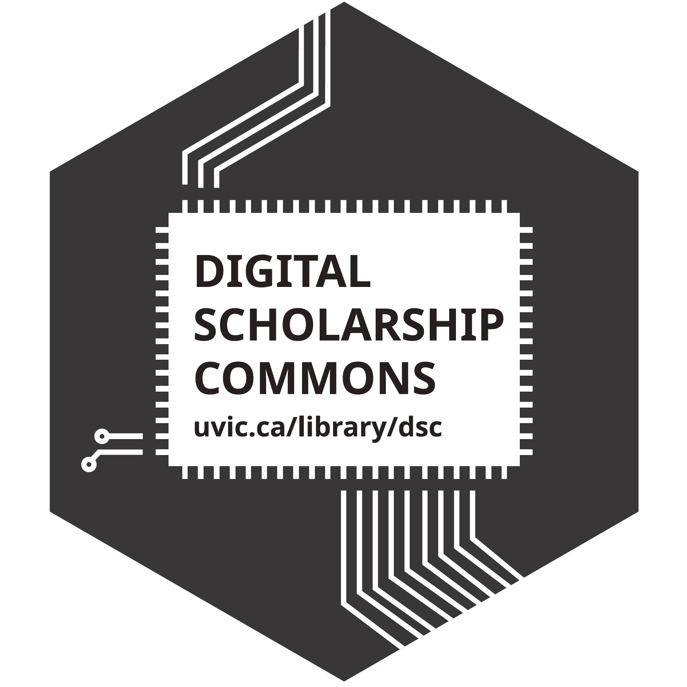

# DSC Workshop Lesson Plans

Check out our full list of [**upcoming scheduled workshops**](https://libcal.uvic.ca/calendar/dsc?cid=7692&t=g&d=0000-00-00&cal=7692&inc=0){:target="_blank"}!

If you have any questions about our workshops or are an instructor wanting to have us run one of our workshops in connection with your course, feel free to [send us an email](mailto:rmccue@uvic.ca?Subject=Workshop%20Request){:target="_blank"} to ask about availability. If you would like to be kept up to date with DSC announcements, including new workshops, you can sign up for our [low-volume email list here](https://e1.envoke.com/ext/pages/7ca0996db17fcc4be7f60392f6790490){:target="_blank"}.

Below are workshops that the DSC has made available for anyone in the world to use free of charge! Everything is online and designed so that people can work through them on their own schedule and at their own pace. If you have questions as you go, feel free to contact us.

## Makerspace Tools
- [3D Design & Print](https://lib.uvic.ca/3d){:target="_blank"} - Introduction
- [3D Design with Fusion 360](https://lib.uvic.ca/fusion360){:target="_blank"} - Intermediate
- [3D Scanning with Your Phone & KIRI Engine](https://lib.uvic.ca/kiri){:target="_blank"}
- [Coding with HTML & CSS](https://lib.uvic.ca/html){:target="_blank"} - Introduction
- [Electronics with Arduino](https://lib.uvic.ca/ard){:target="_blank"}
- [Electronics with Raspberry Pi](https://lib.uvic.ca/raspi){:target="_blank"} (in development)
- [Internet of Things with Arduino](https://lib.uvic.ca/iot){:target="_blank"}
- [Design for Laser Cutting](https://lib.uvic.ca/lasdes){:target="_blank"}
- [Creating 360 Tours & Narrative Maps](https://lib.uvic.ca/vr360){:target="_blank"}

## Data Analysis, Visualization, & Mapping
- [Data Analysis with Excel](https://lib.uvic.ca/xls){:target="_blank"}
- [Data Analysis with RStudio](https://lib.uvic.ca/rstud){:target="_blank"} - Introduction
- [Data Analysis with RStudio](https://lib.uvic.ca/rintr){:target="_blank"} - Intermediate Research Statistics
- [Data Visualization & Narrative Maps](https://lib.uvic.ca/dvis){:target="_blank"} - Introduction
- [Laser Cutting Ocean Floor Contour Maps](https://lib.uvic.ca/laser-maps){:target="_blank"}
- [Data Visualization with Tableau](https://lib.uvic.ca/tab){:target="_blank"} - Intermediate
- [DataFrames in Pandas](https://uviclibraries.github.io/data-frames/){:target="_blank"} (Python)
- [Infographics with Canva](https://lib.uvic.ca/ig){:target="_blank"}
- [Data Wrangling or cleaning with OpenRefine](https://lib.uvic.ca/or){:target="_blank"}
- [Survey Creation with SurveyMonkey](https://lib.uvic.ca/survey){:target="_blank"}
- [Qualitative Data Analysis & Coding with NVIVO](https://lib.uvic.ca/nvivo){:target="_blank"}
- [Qualitative Data Analysis & Coding with NVIVO](https://lib.uvic.ca/nvadv){:target="_blank"} - Advanced
- [Qualitative Coding with Taguette](https://lib.uvic.ca/tag){:target="_blank"}

## Research, Writing, & Communication Tools:
- [Design & Layout with Canva](https://lib.uvic.ca/dl){:target="_blank"} - Introduction
- [Academic Posters with Canva](https://lib.uvic.ca/apc){:target="_blank"}
- [Creating & Teaching Active Learning Workshops](https://lib.uvic.ca/alw){:target="_blank"}
- [Data Management Planning](https://lib.uvic.ca/dmp){:target="_blank"}
- [Death by PowerPoint](https://lib.uvic.ca/ppt-death){:target="_blank"} (Creating Pursuasive & Engaging Presentations)
- [Interactive, Nonlinear Stories with Twine](https://lib.uvic.ca/tw){:target="_blank"}
- [Interactive & Multimedia Website Content with H5P](https://lib.uvic.ca/h5p){:target="_blank"}
- [Knowledge Mobilization Skills](https://lib.uvic.ca/km-hands-on){:target="_blank"} (in development)
- [Scientific Documents with Latex](https://lib.uvic.ca/lt){:target="_blank"}
- [Personal Websites with WordPress](https://lib.uvic.ca/wp){:target="_blank"}
- [Image Editing with GIMP](https://lib.uvic.ca/gimp){:target="_blank"} (an open source Adobe Photoshop alternative)
- [Image Editing with Adobe Photoshop](https://uviclibraries.github.io/photoshop/){:target="_blank"}
- [Photography with your Smartphone](https://lib.uvic.ca/spp){:target="_blank"}
- [Image Editing with Photopea](https://uviclibraries.github.io/image-editing-photopea/){:target="_blank"} (a free Adobe Photoshop alternative)
- [Podcasting with Audacity](https://lib.uvic.ca/pod){:target="_blank"}
- [Sketchnoting: Doodle Your Way to Better Grades](https://lib.uvic.ca/skn){:target="_blank"}
- [Version Control with GitHub](https://lib.uvic.ca/github){:target="_blank"}
- [Video Editing with iMovie or Windows ClipChamp](https://lib.uvic.ca/vid){:target="_blank"} (Win, Mac)

## [Generative AI Workshop Pathway](https://lib.uvic.ca/genai-pathway){:target="_blank"}
- [GenAI: Introduction & Prompt Design](https://lib.uvic.ca/gen-ai){:target="_blank"} (Introduction)
- [AI: Tools for Literature Reviews](https://lib.uvic.ca/ai-lit-search){:target="_blank"} (Introduction)
- GenAI: Spotting AI-generated content online (Introduction) COMING SOON
- [Transcription with Free AI Tools](https://lib.uvic.ca/transcription){:target="_blank"} (Intermediate)
- [GenAI: NotebookLM a Personal Tool for Research & Productivity](https://lib.uvic.ca/genai-notebooklm){:target="_blank"} (Intermediate)
- GenAI: Presentation & Multi-Media Tools (Intermediate) - COMING SOON
- AI: Tools for Literature Reviews (Advanced) - COMING SOON
- [GenAI: Research Tools](https://lib.uvic.ca/genai-research-adv){:target="_blank"} (Advanced)

